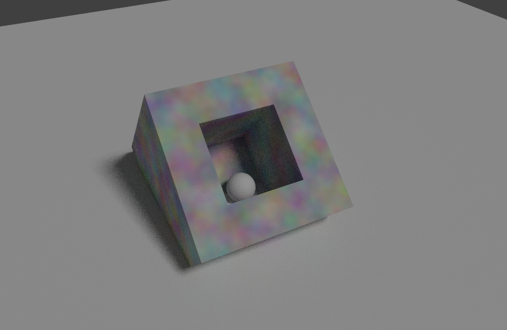
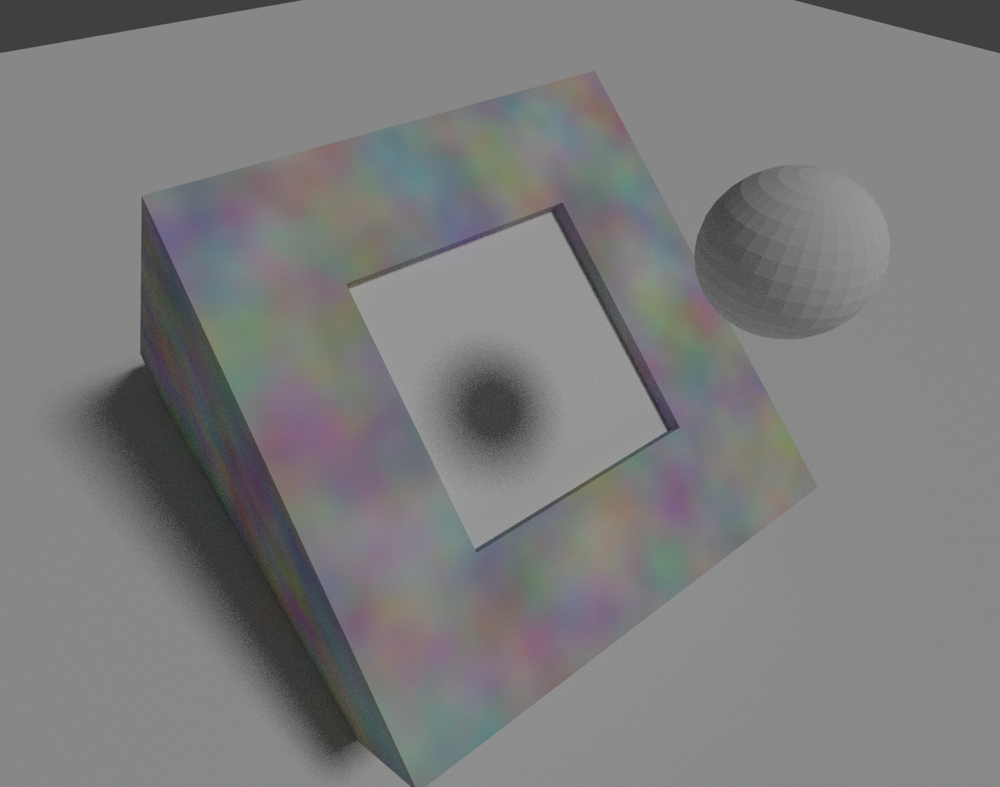
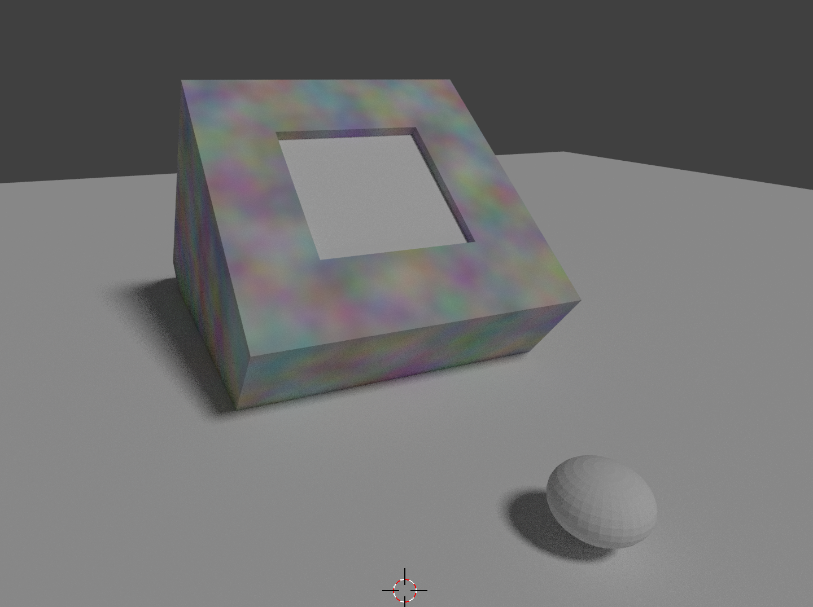
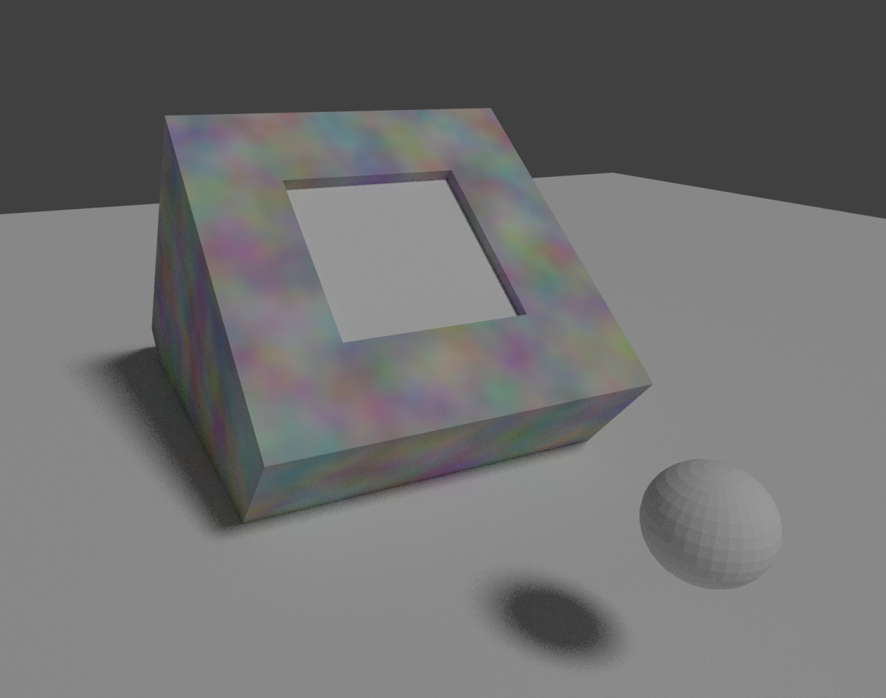
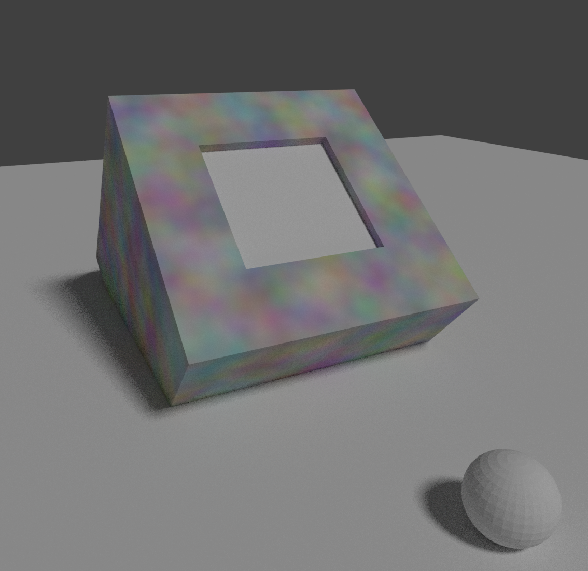
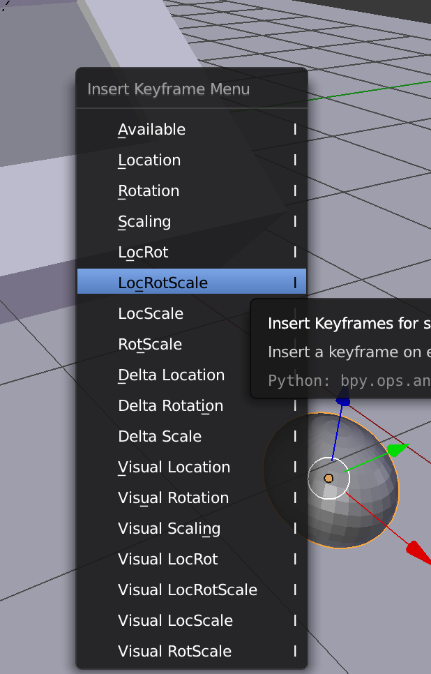
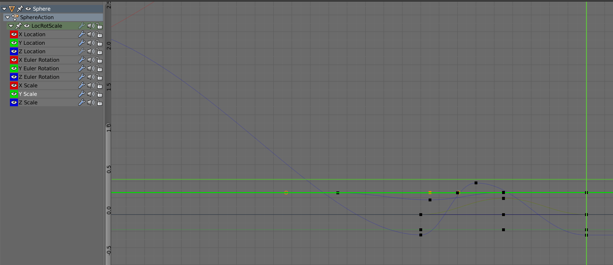
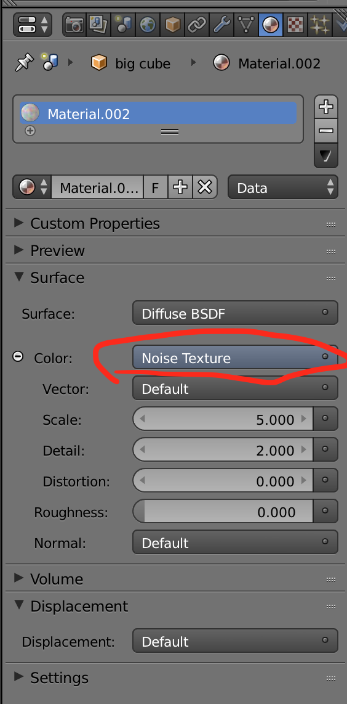
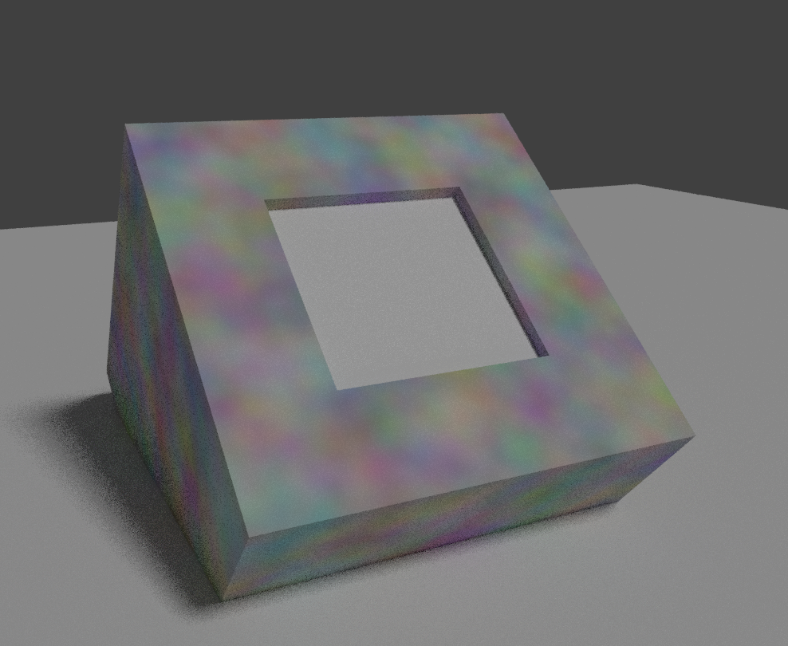
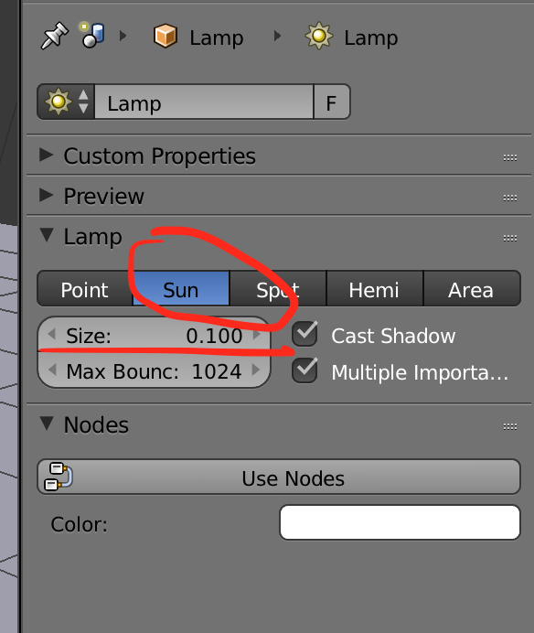

## PAOGD_HW1

#### 介绍

PAOGD个人作业1-弹出的小球-简单建模、插值动画

#### 开发环境

Blender2.8 beta

#### 场景描述

- 镜头1：小球在盒子中

- 镜头2：小球被弹出

- 镜头3：小球掉落在地

- 镜头4：小球从地面反弹

- 镜头5：小球平稳落下

#### 实现难点

- 利用关键帧插值的方式完成动画

  在当前帧，通过快捷键I，创建关键帧，然后更换到另外一个帧，再次通过快捷键I创建关键帧，通过插值之后，会自动对两帧之间进行连续的线性填充，完成平滑的过渡。

  

- 在动画过程中体现物体的旋转、平移、形变等

  通过用LocRotScale创建的关键帧，具有可以调整旋转、平移、形变的属性。

- 利用曲线编辑器graph editor调整物体在动画过程中的属性变化

  如下图所示，我们可以针对某一个属性，动态的调整它在时序上的曲线。

  

- 加分项：尝试给物体添加材质或纹理，使动画更加美观

  进入cycle render模式，在color中选择材质，我选择了系统自带的默认的材质Noise Texture。

  

  经过渲染之后，样式如下：

  

* [附加] 调整光源，设置亮度

  通过改变光源属性中的亮度性能调整亮度，并且设置光源为sun。

  

### 个人项目提交方式

1. 布置的个人项目先fork到个人仓库下；
2. clone自己仓库的个人项目到本地目录；
3. 在个人项目中，在src、report目录下，新建个人目录，目录名为“学号+姓名”，例如“**12345678WangXiaoMing**”；
4. 在“src\12345678WangXiaoMing”目录下，保存项目，按要求完成作业
5. 实验报告以md的格式，写在“report\12345678WangXiaoMing”目录下；
6. 完成任务需求后，Pull Request回主项目的master分支，PR标题为“学号+姓名”， 如“**12345678王小明**”；
7. 一定要在deadline前PR。因为批改后，PR将合并到主项目，所有同学都能看到合并的结果，所以此时是不允许再PR提交作业的。